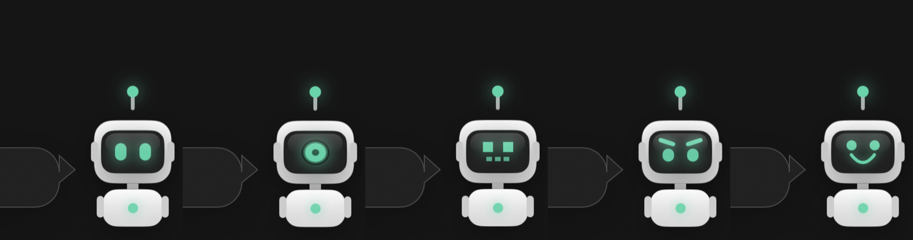
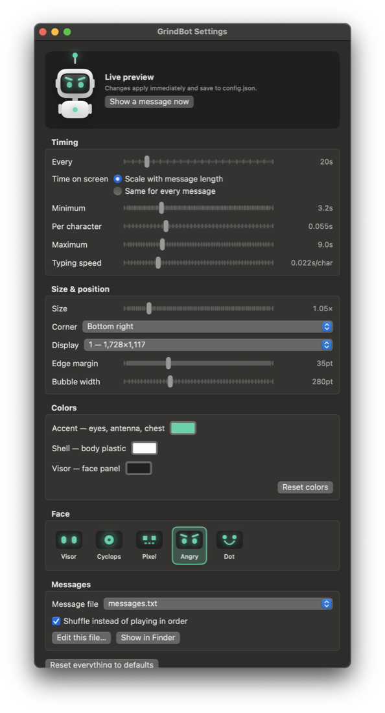

# GrindBot

**A tiny robot yells at you. Free.**

A tiny robot pops up in the corner of your screen, says something, and
disappears. Built for screen recordings and social posts.



[grindbot.melbora.com](https://grindbot.melbora.com) · MIT · no telemetry, no
network calls, no account.

macOS and Windows. The rest of this README is the macOS build; for Windows see
**[windows/README.md](windows/README.md)** — same robot, same `config.json`,
same message packs, built with `windows\build.ps1`.

No dock icon, no window to manage, no backend. It sits in the menu bar and
draws itself over whatever you're doing — click-through, so it never steals
focus or interrupts what you're recording.

## Requirements (macOS)

macOS 13+ and the Xcode command line tools:

```
xcode-select --install
```

## Build and run

```
git clone <your-repo-url> GrindBot
cd GrindBot
./build.sh
open GrindBot.app
```

`build.sh` compiles `Sources/*.swift` into `GrindBot.app` and ad-hoc signs
it. The app is unsigned by Apple, so if you move it somewhere macOS treats as
quarantined, right-click → Open once to get past Gatekeeper.

## Menu bar

Everything is under the 🤖 icon:

| Item | What it does |
|---|---|
| Settings… (⌘,) | Open the settings window — every option below, with live preview |
| Say something now | Fire a message immediately — useful for hitting a cue while recording |
| Turn off / Turn on | Stop the popups without quitting. Icon becomes 💤. Turning it back on fires one right away |
| Face | Switch robot face. Saved to `config.json`, like every other setting |
| Only when I'm idle | Hold messages until you have stopped typing for `idleSeconds` |
| Start at login | Register the app to launch when you log in |
| Reload config & messages | Re-read both files without rebuilding |
| Edit messages… / Edit config.json… | Open the files in your default editor |
| Quit | Shut it down |

## Settings window



**Settings…** in the menu opens a window with every option in one place:
timing, size, screen corner and display, robot colors, face, and message file.

Changes apply immediately — the robot resizes, moves, or recolors as you drag
a slider — and save themselves to `config.json`. The **Every** slider snaps to
sensible steps from 5 seconds up to 5 hours. There's no OK or Cancel; what
you see is what's running. **Show a message now** fires one so you can check
the result without waiting for the timer.

Editing `config.json` by hand still works and is the better path for version
control or sharing a setup with someone else. Hit **Reload config & messages**
after an external edit.

## Messages

One per line in `messages.txt`. Blank lines and lines starting with `#` are
ignored.

```
Lock in bro or your family dies 💀
WHO IS GONNA CARRY THE BOATS?
```

Edit the file, then hit **Reload config & messages**. No rebuild needed.

Five packs ship in `packs/`:

| Pack | Lines | Tone |
|---|---|---|
| `classic.txt` | 5 | The originals |
| `hustle.txt` | 24 | Aggressive entrepreneur |
| `discipline.txt` | 15 | No excuses, drill sergeant |
| `habits.txt` | 30 | Hours, momentum, decay — aimed at the habit |
| `obituary.txt` | 30 | Mortality and legacy. The bleak one |

`habits.txt` and `obituary.txt` run longer per line than the others, so they
wrap to two or three lines in the bubble and sit on screen longer under the
default `dwellMode: "length"`.

Point `messagesFile` at one, or write your own:

```json
{ "messagesFile": "packs/hustle.txt" }
```

Messages cycle in order. Set `"shuffle": true` for random order (it shuffles
the whole list, plays through it, then reshuffles — so nothing repeats until
everything has been shown).

## Configuration

`config.json` is yours: the first build copies it from `config.default.json`,
and it's gitignored so your settings never turn up as repo changes. Delete it
and rebuild to get the defaults back.

Edit it next to the app, then **Reload config & messages**. Every key is
optional; anything missing or malformed falls back to the default, so
a broken file degrades rather than crashes.

| Key | Default | What it does |
|---|---|---|
| `intervalSeconds` | `20` | Seconds between messages. Anything from 1 second up; the settings slider covers 5s to 5h |
| `dwellMode` | `"length"` | `"length"` scales time on screen with message length, `"fixed"` uses the same time for every message |
| `dwellBase` | `3.2` | Length mode: minimum seconds on screen |
| `dwellPerCharacter` | `0.055` | Length mode: seconds added per character |
| `dwellMax` | `9` | Length mode: ceiling, no matter how long the text |
| `dwellSeconds` | `5` | Fixed mode: seconds on screen |
| `scale` | `1.5` | Overall size. `1.0` is the original, clamped to `0.5`–`4.0` |
| `position` | `"bottomRight"` | `bottomRight`, `bottomLeft`, `topRight`, `topLeft`. The layout mirrors itself on the left |
| `screenIndex` | `0` | Which display: `0` is primary, `1` the next, `-1` follows keyboard focus |
| `face` | `"visor"` | `visor`, `cyclops`, `pixel`, `angry`, `dot` |
| `accent` | `"#33D6A8"` | Eyes, antenna, chest light |
| `shell` | `"#FCFCFC"` | Robot body plastic. Ears, arms and neck are derived shades of it |
| `visor` | `"#212121"` | The dark face panel behind the eyes |
| `typeSpeed` | `0.022` | Seconds per character for the typewriter effect. `0` shows the whole message at once |
| `shuffle` | `false` | Random order instead of in-order |
| `messagesFile` | `"messages.txt"` | Path to the message file, relative to the app. An array draws from several: `["packs/habits.txt", "packs/hustle.txt"]` |
| `allMessageFiles` | `false` | Draw from every message file found, ignoring `messagesFile` |
| `theme` | `"auto"` | Speech-bubble colors: `auto` follows the system light/dark setting, `dark` and `light` pin it |
| `idleOnly` | `false` | Hold messages until you have stopped typing |
| `idleSeconds` | `120` | How long you must be quiet first. Clamped to 5 seconds minimum |
| `margin` | `22` | Padding inside the popup, in points, scaled by `scale / 1.5` — so it is the gap you see at the default scale, and proportionally larger or smaller at others |
| `maxBubbleWidth` | `280` | Bubble width before wrapping, before `scale` is applied |

### Timing

With `dwellMode: "length"`, time on screen is:

```
min(dwellMax, dwellBase + characters × dwellPerCharacter)
```

So a 20-character line sits for ~4.3s and a 60-character line for ~6.5s, both
capped at `dwellMax`. Typing happens inside that window, so longer messages
still get read time after they finish typing.

## Faces


`visor` (two glowing eyes), `cyclops` (one big lens), `pixel` (8-bit),
`angry` (angled brows), `dot` (eyes and a smile).

Pick one in the settings window, from the **Face** menu, or set `face` in
`config.json`.

Colors are independent of the face: `accent` drives the eyes, antenna and
chest light, `shell` the body, `visor` the panel behind the eyes. A dark
`shell` with a bright `accent` gives a very different robot from the default.

## Windows

The Windows port lives in [`windows/`](windows/) and is a full rewrite in WPF —
same robot, same faces, same `config.json`, same message packs, driven from the
system tray instead of the menu bar.

```powershell
cd windows
.\build.ps1 -Run
```

Settings live in `%APPDATA%\GrindBot` rather than next to the app, since the
Windows build folder is disposable. See [windows/README.md](windows/README.md)
for the details and the handful of platform differences.

## Customizing

See [CUSTOMIZING.md](CUSTOMIZING.md) for the code layout, how to add your own
face, and how to change the drawing.

## License

MIT — see [LICENSE](LICENSE).
